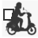
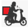
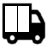
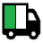
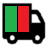
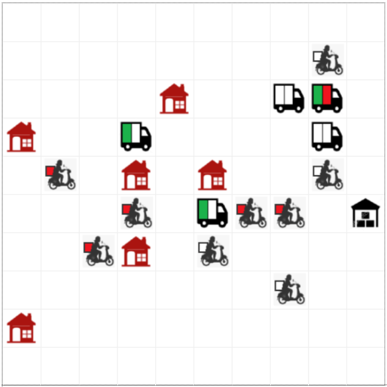
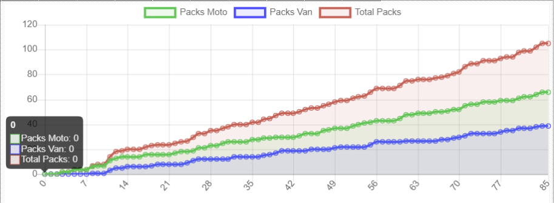

# Last Mile Multiagent System 

This project tries to simulate a delivery environment for the delivery of packages from a base to different 
businesses in a grid within a working day divided in 1400 minutes, each minute corresponding to a step within 
the environment.

### Agents

|  Base  | Business |  Moto  | Full Moto |  Van  | Half Full Van |   Full Van  | 
|:---:|:---:|:---:|:---:|:---:|:---:|:---:|
|  |  |  |  | |  |  |

There are two different types of delivery men, or riders, depending on their package carrying capacity: motorcycles, 
which can deliver one package, and vans, or vans, which can deliver two. Riders in this version have an optimal form 
of movement, that is, they always move to the space closest to their target. Deliveries deliver packages which is a 
separate object with a single "destination" parameter that determines where it should be delivered.
On the other hand, we have the base, which controls the delivery times so that the distributors adapt to a business 
schedule. If the base estimates that it is outside working hours, it prevents delivery men from continuing to work. 

The base establishes communication with the agents that are in their location and determines if they have packages or not. 
If they did not have packages, or had room for one more in the case of vans, I would deliver a new package.

In last place we have the business or business, which are the objectives where the distributors must deliver the package. 
These businesses will be open or not depending on a certain probability (0.8 starting). If the business is closed, 
the delivery person will not be able to deliver the package. The dealer will hold in the business box as long as his 
parameter "patience" allows. This parameter is a scalar (starting 3) that will be reduced by one with each step in the 
environment, until it reaches 0. If patience reaches 0, the package to be delivered is placed at the end of the list 
and proceeds with the next package.

### Visualization

To finish, both the grid where the simulation takes place, as well as the statistics of the packages delivered, can be 
viewed in the Browser itself where all the components mentioned above are rendered. Each agent has a different sprite 
and in the case of delivery men this changes depending on the number of packages they carry.

As an idea for future versions. It would be interesting to observe how agents behave if we established a Cross Entropy 
Reinforcement Learning algorithm to calculate their movement policy. Since on the one hand in these discrete deterministic 
environments it works well, but on the other the agents' objective is changing (destination of the packages) which can 
make training difficult.