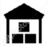

# Last Mile Multiagent System 

This project tries to simulate a delivery environment for parcel delivery from a base 
to different businesses within a grid. There are two different types of riders depending on their 
package transport capacity: motorcycles can deliver one package and vans can deliver two. The base 
controls the delivery times so that they adapt to a business schedule.

### Agents

|  Base  | Business |  Moto  | Full Moto |  Van  | Half Full Van |   Full Van  | 
|:---:|:---:|:---:|:---:|:---:|:---:|:---:|
|  |  |  |  | |  |  |

